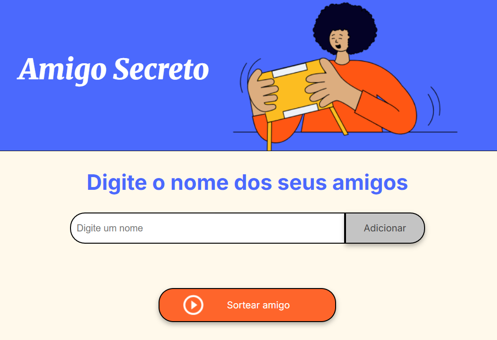

<h1 align="center">🎁 Amigo Secreto</h1>

<p align="center">
  Aplicação interativa para organizar sorteios de <b>Amigo Secreto</b>, desenvolvida em <b>HTML, CSS e JavaScript</b>.  
</p>

<p align="center">
  
</p>

---

# 📌 Índice
- [🏆 Badges](#-badges)
- [📖 Descrição do Projeto](#-descrição-do-projeto)
- [📌 Status do Projeto](#-status-do-projeto)
- [✨ Funcionalidades](#-funcionalidades)
- [🔗 Acesso ao Projeto](#-acesso-ao-projeto)
- [🛠️ Tecnologias Utilizadas](#️-tecnologias-utilizadas)
- [🙌 Contribuidores](#-contribuidores)
- [👨‍💻 Desenvolvedor](#-desenvolvedor)
- [📜 Licença](#-licença)
- [✅ Conclusão](#-conclusão)

---

## 🏆 Badges
<p align="center">
  
  
  
</p>

---

## 📖 Descrição do Projeto
O **Amigo Secreto** é uma aplicação prática e intuitiva que permite:  
- Criar uma lista de amigos  
- Remover participantes  
- Realizar o sorteio de forma automática  

Ideal para eventos, confraternizações e brincadeiras em família ou entre amigos. 🎉  

---

## 📌 Status do Projeto
✅ **Finalizado**  
O projeto foi concluído e está pronto para uso.  

---

## ✨ Funcionalidades
✔️ Adicionar amigos à lista  
✔️ Remover amigos individualmente ❌  
✔️ Limpeza automática do campo após adicionar  
✔️ Adicionar amigos com a tecla **Enter**  
✔️ Sorteio automático de um amigo aleatório  
✔️ Validação de entrada (não permite nomes vazios)  

---

## 🔗 Acesso ao Projeto
🔹 Acesse online: [Clique aqui]()  


Ou rode localmente:  
```bash
git clone https://github.com/seu-usuario/amigo-secreto.git
cd amigo-secreto
